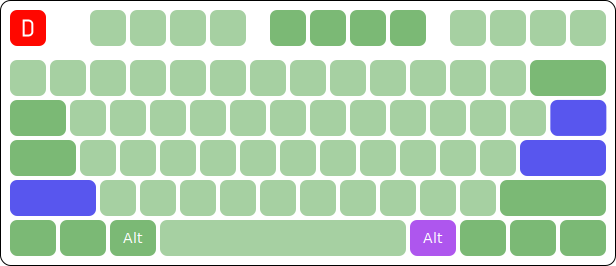
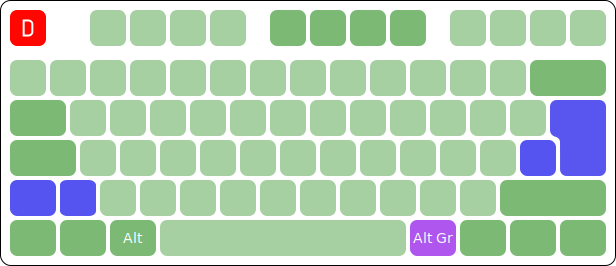

# Tiny yet mighty convenient AutoHotkey v2 scripts

For AutoHotkey v2.0-a122.
See [installation instructions](#installation-instructions).

- [The scripts](#the-scripts)
  - [`caps_to_esc.ahk`](#caps_to_escahk)
  - [`special_characters.ahk`](#special_charactersahk)
  - [`wide_left_shift.ahk`](#wide_left_shiftahk)
- [Installation instructions](#installation-instructions)
- [Remarks](#remarks)
- [License](#license)

## The scripts

### [`caps_to_esc.ahk`](scripts/caps_to_esc.ahk)

**Maps <kbd>CapsLock</kbd> to <kbd>Esc</kbd>.**

Especially useful in Vim and Vim-like editors.
Also useful with
[Vimium (a Firefox extension)](https://addons.mozilla.org/en-US/firefox/addon/vimium-ff/)
and
[Vimium (a Chrome extension)](https://chrome.google.com/webstore/detail/vimium/dbepggeogbaibhgnhhndojpepiihcmeb).

If you need to toggle <kbd>CapsLock</kbd>,
hold <kbd>Right Ctrl</kbd> and press <kbd>CapsLock</kbd>.
I don't recall ever needing this.

### [`special_characters.ahk`](scripts/special_characters.ahk)

**Provides [hotstrings] to easily type special characters.**

[hotstrings]: https://lexikos.github.io/v2/docs/Hotstrings.htm

My favorite script!
Makes life so much easier.

These four hotstrings are the most important for me:

- When I type `h;`, the characters get replaced with ö.
- When I type `H;`, the characters get replaced with Ö.
- When I type `h'`, the characters get replaced with ä.
- When I type `H'`, the characters get replaced with Ä.

Before I created this script,
I was constantly toggling the input language
between US English and Finnish
with <kbd>Win</kbd> + <kbd>Space</kbd>.
I switched to Finnish when I was writing Finnish (my native language)
and otherwise kept US English active.

But man, it was _so annoying_
to forget many times a day which one is the currently active input language.
It was also unergonomic to constantly toggle between the two.

No more!
Now I can keep US English active all the time
while still being able to write Finnish comfortably.

I have tried many different hotstrings for typing ä's and ö's,
but the above hostrings seem to be the most ergonomic and comfortable for me.
There are a few apps and situations
where the hotstrings don't work reliably,
but they work like 95% of the time,
and that's enough for me.

Below are the next four hotstrings
that I use the most.
The "HTML entity" column
is just for reference.

| Type this | Get this | HTML entity | Comments
| --------- | -------- | ----------- | --------
| `;b`      | •        | `&bull;`    | Bullet; great for bullet lists
| `;nd`     | –        | `&ndash;`   | En dash
| `;ra`     | →        | `&rarr;`    | Right arrow
| `;times`  | ×        | `&times;`   | Multiplication sign

And here are the rest of the hotstrings
provided by the script.
I use these only rarely,
but they are nice to have around.

| Type this    | Get this | HTML entity | Comments
| ------------ | -------- | ----------- | --------
| `;aring`     | å        | `&aring;`   | Used in Finnish, but extremely rarely
| `;Aring`     | Å        | `&Aring;`   | ↑
|              |          |             |
| `;da`        | ↓        | `&darr;`    | Down arrow
| `;la`        | ←        | `&larr;`    | Left arrow
| `;ua`        | ↑        | `&uarr;`    | Up arrow
|              |          |             |
| `;ae`        | ≈        | `&approx;`  | Almost equal to / Approximately
| `;ne`        | ≠        | `&ne;`      | Not equal to
|              |          |             |
| `;copy`      | ©        | `&copy;`    | Copyright
| `;deg`       | °        | `&deg;`     | Degree
| `;eur`       | €        | `&euro;`    | Euro
| `;hellip`    | …        | `&hellip;`  | Horizontal ellipsis
| `;md`        | —        | `&mdash;`   | Em dash
| `;middot`    | ·        | `&middot;`  | Middle dot
| `;nb`        |          | `&nbsp;`    | Non-breaking space
| `;reg`       | ®        | `&reg;`     | Registered trademark
| `;tm`        | ™        | `&trade;`   | Trademark
|              |          |             |
| `;lenny`     | ( ͡° ͜ʖ ͡°) |             | Look ma, it's Lenny!
| `;dis`       | ಠ_ಠ     |             | Look of **dis**approval

### [`wide_left_shift.ahk`](scripts/wide_left_shift.ahk)

**Maps the extra key
between the <kbd>Left Shift</kbd> and <kbd>Z</kbd> keys
to <kbd>Left Shift</kbd>.**

What extra key?
My work laptop's keyboard has an ISO layout,
so the <kbd>Left Shift</kbd> key is narrower than in ANSI layouts,
and there's an extra key
between the <kbd>Left Shift</kbd> and <kbd>Z</kbd> keys.

I use US English as the input language in Windows,
so the extra key is unnecessary for me.
With this script
I can pretend that
the <kbd>Left Shift</kbd> key is as wide as it should be.

ANSI keyboard layout:



ISO keyboard layout:



<sup>Keyboard layout illustrations by Daniel Beardsmore,
from [_ANSI vs ISO_ page on Deskthority wiki](https://deskthority.net/wiki/ANSI_vs_ISO).
Illustrations minified with
[SVGOMG](https://jakearchibald.github.io/svgomg/).</sup>

## Installation instructions

1. Download [AutoHotkey v2](https://www.autohotkey.com/v2/) (a zip file).
   - The scripts are developed for v2.0-a122.
     Newer versions might also work
     since the scripts are very simple.
2. Extract the zip file e.g. to `%programfiles%/AutoHotkey_2.0-a122/`.
   - To open the `Program Files` folder,
     press <kbd>Ctrl</kbd> + <kbd>r</kbd>,
     type `%programfiles%` to the Run window,
     and press <kbd>Enter</kbd>.
3. Download the scripts that fancy you
   or clone the whole repo:
   ```sh
   git clone https://github.com/mtsknn/AutoHotkey.git
   ```
4. Open the scripts that fancy you.
   - When opening an `.ahk` file for the first time,
     Windows should ask you
     what program to use to open the file.
     Choose `AutoHotkeyU64.exe`
     from the folder where you extracted the zip file.
5. To run the scripts automatically
   when logging in to Windows,
   create shortcuts for the scripts
   and place the shortcuts
   to `%appdata%/Microsoft/Windows/Start Menu/Programs/Startup`.
   - To create a shortcut,
     right click on a file
     and select "Create shortcut."
   - To open the folder,
     press <kbd>Ctrl</kbd> + <kbd>r</kbd>,
     paste the above path to the Run window,
     and press <kbd>Enter</kbd>.
   - You could probably put the scripts straight to the `Startup` folder,
     i.e. it might not be necessary to create shortcuts of them.
6. Bonus points if you modify the scripts to your liking.

## Remarks

The [`#SingleInstance` directive](https://lexikos.github.io/v2/docs/commands/_SingleInstance.htm)
is used in every script.
It allows only a single instance of a script to be running,
so that running a script that is already running
makes the new instance replace the old instance automatically.

## License

MIT &copy; [Matias Kinnunen](https://mtsknn.fi/)
